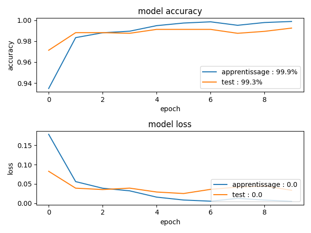
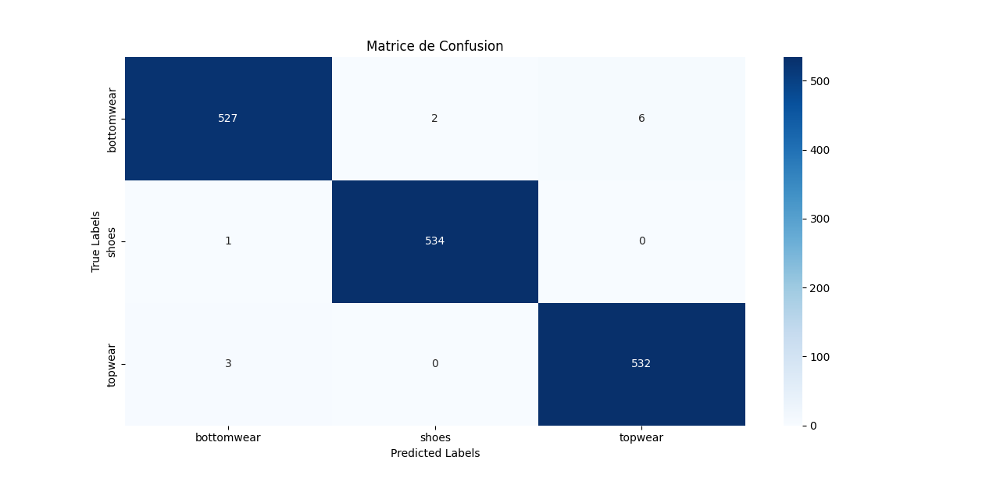
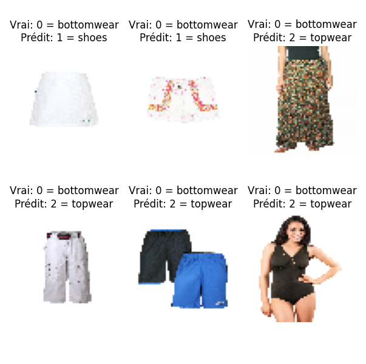
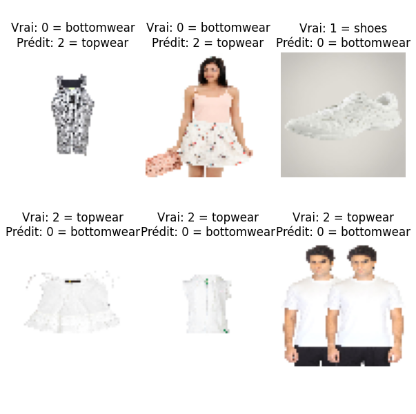

# Modèle de CNN qui prédit la catégorie du vêtement à partir d'une image

## Sommaire
- [Chargement des données](#chargement-des-données)
  - [Description](#description)
  - [Fonctionnalités principales](#fonctionnalités-principales)
- [Modèle CNN](#modèle-cnn)
  - [Fonctionnalités principales CNN](#fonctionnalités-principales-cnn)
  - [Fonctions clés](#fonctions-clés)
  - [Comment exécuter](#comment-exécuter)
  - [Interprétation des performances du modèle](#interprétation-des-performances-du-modèle)
    - [Courbes de précision et de perte](#courbes-de-précision-et-de-perte)
    - [Analyse de la perte](#analyse-de-la-perte)
  - [Analyse de la matrice de confusion](#analyse-de-la-matrice-de-confusion)
    - [Interprétation des résultats](#interprétation-des-résultats)
  - [Analyse des images mal classées](#analyse-des-images-mal-classées)
- [API de classification d'images](#api-de-classification-dimages)
  - [Fonctionnement de l'API](#fonctionnement-de-lapi)
  - [Déploiement de l'API](#déploiement-de-lapi)

## Chargement des données

### Description
Ce script est conçu pour traiter, organiser et équilibrer des ensembles de données d'images à partir d'un grand ensemble de produits de mode récupéré à partir du script **load_data.py**. Il extrait les images et leurs métadonnées correspondantes à partir de fichiers JSON et les classe dans des sous-catégories prédéfinies. Le script équilibre ensuite le nombre d'images dans ces sous-catégories afin d'assurer une représentation égale pour les modèles d'entraînement.

### Fonctionnalités principales
- **Nettoyage des données** : Nettoie et prépare le dossier cible en supprimant le contenu existant et en recréant la structure de dossiers nécessaire.
- **Catégorisation des images** : Extrait des sous-catégories telles que "Shoes", "Topwear" et "Bottomwear" à partir des métadonnées JSON et déplace les images correspondantes dans les dossiers catégorisés.
- **Équilibrage des classes** : Assure une représentation équilibrée en supprimant des images aléatoires dans les catégories surreprésentées, rendant l'ensemble de données adapté à l'entraînement de modèles avec des données équilibrées.

## Modèle CNN 
Ce deuxième script est également inclus pour la construction, l'entraînement et l'évaluation d'un modèle de réseau de neurones convolutif (CNN) pour la classification des images de vêtements. Ce script intègre des étapes de vérification des fichiers, de chargement et d'augmentation des données, de construction du modèle CNN, d'entraînement, de visualisation des métriques, et d'affichage des prédictions et de la matrice de confusion.

### Fonctionnalités principales CNN
- **Vérification des fichiers** : Vérifie la validité et l'existence des fichiers dans un répertoire spécifié.
- **Chargement et augmentation des données** : Utilise `ImageDataGenerator` pour normaliser et augmenter les images pour l'entraînement et la validation.
- **Construction du modèle CNN** : Crée un modèle CNN avec plusieurs couches convolutives, de max-pooling et des couches fully connected, ainsi qu'une couche de sortie adaptée au nombre de classes.
- **Entraînement du modèle** : Entraîne le modèle sur les données d'entraînement et utilise les données de test pour la validation.
- **Visualisation des métriques** : Affiche les courbes de précision et de perte pour évaluer la performance du modèle.
- **Affichage des prédictions** : Affiche quelques images mal classées par le modèle avec leurs étiquettes prédites et réelles.
- **Matrice de confusion** : Calcule et affiche la matrice de confusion pour analyser la performance du modèle sur l'ensemble de test.

### Fonctions clés
- `checkFileIsGood(directory)` : Vérifie si les fichiers dans un répertoire sont valides ou existent.
- `afficher_images(data_generator, n_images=5)` : Affiche un échantillon d'images du générateur de données.
- Construction et entraînement du modèle CNN avec `Sequential()` et différentes couches (`Conv2D`, `MaxPooling2D`, `Dense`, `Dropout`).
- Visualisation des métriques et génération de la matrice de confusion avec `matplotlib` et `seaborn`.

### Comment exécuter
1. **Préparer les données** : Placez les dossiers d'entraînement, de validation et de test sous le chemin spécifié.
2. **Exécuter le script** : Lancez le script pour entraîner le modèle CNN et afficher les métriques de performance.
3. **Analyser les résultats** : Consultez les courbes de précision, les images mal classées, et la matrice de confusion.

### Interprétation des performances du modèle

#### Courbes de précision et de perte
Les courbes de précision et de perte du modèle montrent des performances remarquables :

- **Précision d'apprentissage** : Le modèle atteint une précision de 99,9 % sur l'ensemble d'apprentissage, indiquant que le modèle a bien appris les caractéristiques des données d'entraînement.
- **Précision sur l'ensemble de test** : La précision sur l'ensemble de test est de 99,3 %, ce qui montre que le modèle généralise bien et a de bonnes performances sur des données non vues.

#### Analyse de la perte
- **Perte sur l'ensemble d'apprentissage** : La courbe de perte atteint pratiquement 0, indiquant que le modèle s'est ajusté presque parfaitement aux données d'entraînement.
- **Perte sur l'ensemble de test** : La perte sur l'ensemble de test reste très faible, ce qui confirme la stabilité du modèle et l'absence de surapprentissage significatif.

Ces résultats indiquent que le modèle est capable de classer efficacement les images de vêtements avec une très haute précision et des pertes minimales, garantissant ainsi une performance optimale sur l'ensemble des données.

### Analyse de la matrice de confusion

La matrice de confusion obtenue met en évidence la capacité du modèle à classer correctement les images dans les catégories `bottomwear`, `shoes` et `topwear`.

#### Interprétation des résultats
- **Bottomwear** : 527 images sur 535 ont été correctement classées comme `bottomwear`, avec seulement 8 erreurs (2 images classées comme `shoes` et 6 comme `topwear`).
- **Shoes** : 534 images sur 535 ont été correctement classées, avec une seule erreur d'image classée comme `bottomwear`.
- **Topwear** : 532 images sur 535 ont été correctement identifiées, avec 3 images mal classées comme `bottomwear`.

La matrice de confusion montre que le modèle atteint un haut niveau de précision pour chaque classe, avec un très faible nombre d'erreurs de classification qui sont au nombre de **12** au total.

### Analyse des images mal classées

Les erreurs de classification peuvent être dues à :
- **Similarités visuelles** : Des articles ayant des caractéristiques partagées (couleur, forme, texture) qui induisent le modèle en erreur. Sur certaines images, on observe des `bottomwear` et `topwear` sur la même image qui sera difficile de dire quelle image est concernée.

## API de classification d'images
Un script API utilisant **FastAPI** est inclus pour permettre la classification des images de vêtements à partir de requêtes HTTP.

### Fonctionnement de l'API
- **Chargement du modèle** : Le modèle `mon_modele_bis.h5` est chargé au démarrage de l'API.
- **Détection des classes** : Les classes `bottomwear`, `shoes` et `topwear` sont prédéfinies.
- **Points d'entrée principaux** :
  - `GET /` : Retourne un message de bienvenue pour vérifier que l'API fonctionne.
  - `POST /predict/` : Prend en entrée un fichier image (JPEG ou PNG), le prétraite, et retourne la classe prédite ainsi que la probabilité associée.
- **Traitement des images** : Les images sont redimensionnées à 64x64 pixels, normalisées, et prédites par le modèle.
- **Sortie** : La réponse inclut la classe prédite, la probabilité de la prédiction et l'image encodée en base64.

### Déploiement de l'API
L'API est déployée sur Heroku et accessible à l'adresse suivante :
[https://cnn-api-clothing-4d8c986cc770.herokuapp.com/](https://cnn-api-clothing-4d8c986cc770.herokuapp.com/)